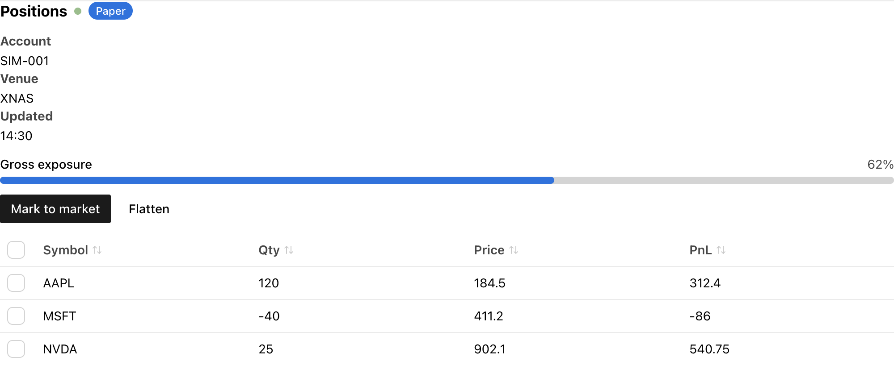
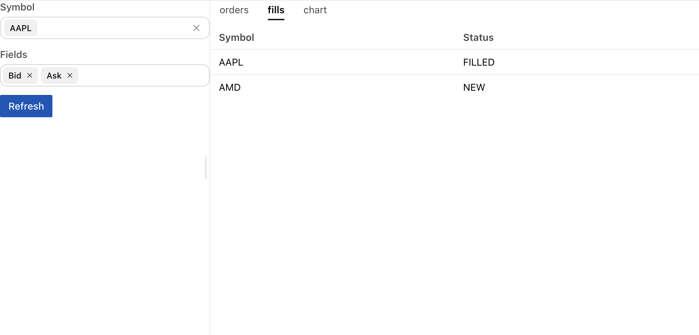
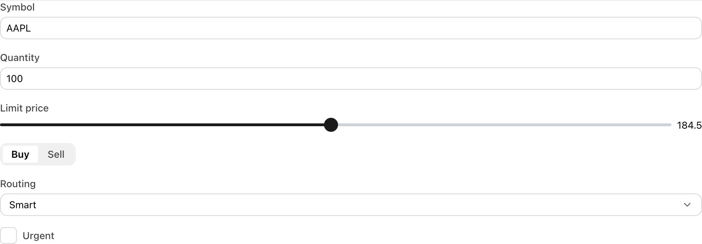
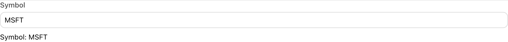
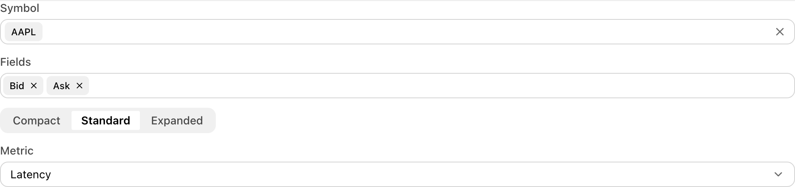
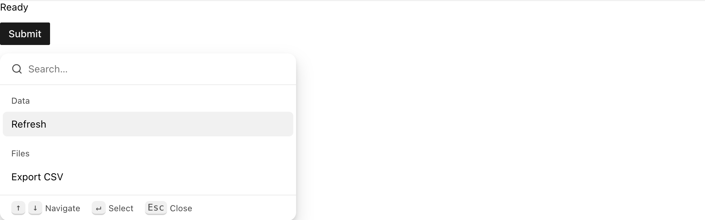
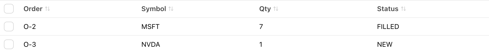
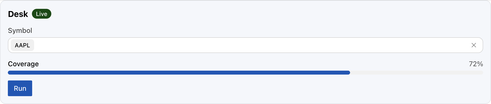
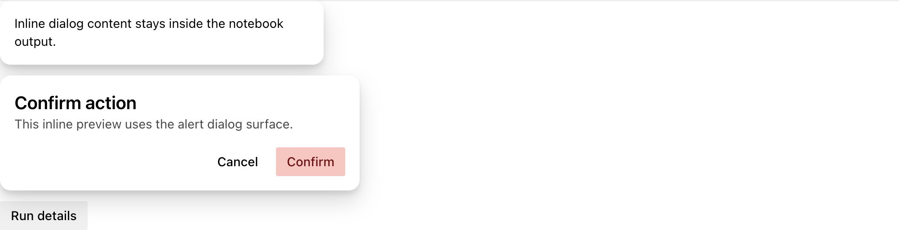

Astryx controls are the component family for notebook UIs in `anylumino`: the
interactive building blocks for forms, filters, command panels, tables, status
surfaces, and themes. They synchronize Python state through normal traitlets
and compose inside Lumino layouts or other Astryx containers.

Useful appearance and behavior options are keyword-only constructor arguments
with Python snake-case names. Unmodeled JSON-safe upstream options remain
available through `**props`; React nodes, refs, render functions, and
JavaScript-only test props are not promoted to the Python API. See the
[Astryx component documentation](https://astryx.atmeta.com/components) for the
upstream component reference.

## Notebook dashboard

A position monitor built only from Astryx controls. The button callback edits
table rows and moves the progress bar from Python:

```python
import anylumino as al
import anylumino.astryx as ax

positions = ax.Table(
    rows=position_rows,
    columns={"symbol": "Symbol", "qty": "Qty", "price": "Price", "pnl": "PnL"},
    row_key="symbol",
    selects="single",
    sortable=True,
    width="100%",
)
exposure = ax.ProgressBar(62, label="Gross exposure", variant="accent", value_label=True)

def mark_to_market(_button):
    for row in positions.rows:
        positions.update_row(row["symbol"], {"pnl": round(row["pnl"] * 1.1, 2)})
    exposure.value = min(exposure.value + 8, 100)

ax.Theme(
    {
        "header": ax.Stack(
            {
                "title": ax.Heading("Positions", level=3),
                "status": ax.StatusDot("Connected", variant="success", pulsing=True),
                "badge": ax.Badge("Paper", variant="info"),
            },
            direction="horizontal",
            align="center",
            gap=2,
        ),
        "summary": ax.MetadataList(
            [
                {"label": "Account", "value": "SIM-001"},
                {"label": "Venue", "value": "XNAS"},
                {"label": "Updated", "value": "14:30"},
            ],
            columns="multi",
        ),
        "exposure": exposure,
        "actions": ax.Stack(
            {
                "mark": ax.Button("Mark to market", variant="primary", callbacks=[mark_to_market]),
                "flatten": ax.Button("Flatten", variant="ghost"),
            },
            direction="horizontal",
            gap=2,
        ),
        "positions": positions,
    },
    gap=3,
)
```



## Component groups

The groups below follow how a notebook UI is put together: composition first,
then content, inputs, actions, feedback, overlays, and data. Every class lives
in the `anylumino.astryx` namespace; the module in parentheses is where its API
reference page is.

| Group                                          | Use for                                                                                                                                       | Components                                                                                                                                                                                                                                                                            |
| ---------------------------------------------- | --------------------------------------------------------------------------------------------------------------------------------------------- | ------------------------------------------------------------------------------------------------------------------------------------------------------------------------------------------------------------------------------------------------------------------------------------- |
| Foundation and theme (`base`)                  | Define a shared brand, theme a subtree, or wrap an Astryx component that has no Python class yet                                              | `Widget`, `Component`, `Brand`, `BuiltTheme`, `Theme`                                                                                                                                                                                                                                 |
| Layout panels (`layout`)                       | Structure a notebook UI with the keyed Lumino child API: tabs, one-at-a-time panels, collapsible sections, scrolling, resizable panes, reflow | `TabPanel`, `StackedPanel`, `AccordionPanel`, `ScrollBox`, `SplitPanel`, `ResponsivePanel`                                                                                                                                                                                            |
| Layout containers (`surfaces`)                 | Arrange content inside a panel or a notebook output                                                                                           | `Stack`, `Grid`, `Center`, `Section`, `Card`, `ClickableCard`, `SelectableCard`, `AspectRatio`, `Divider`, `Collapsible`, `Carousel`                                                                                                                                                  |
| Typography and content (`inputs`, `data`)      | Headings, body copy, rendered Markdown, code, links, avatars, and small semantic content                                                      | `Text`, `Heading`, `Markdown`, `Code`, `CodeBlock`, `Blockquote`, `Kbd`, `Link`, `Citation`, `Timestamp`, `Thumbnail`, `Avatar`, `AvatarGroup`, `Icon`                                                                                                                                |
| Forms and direct inputs (`inputs`, `surfaces`) | Direct value entry and form composition                                                                                                       | `FormLayout`, `Field`, `FieldStatus`, `InputGroup`, `TextInput`, `TextArea`, `NumberInput`, `Slider`, `LogSlider`, `SelectionSlider`, `Checkbox`, `Switch`, `ToggleButton`, `ToggleButtonGroup`, `DateInput`, `DateRangeInput`, `DateTimeInput`, `TimeInput`, `Calendar`, `FileInput` |
| Selection and search (`inputs`, `surfaces`)    | Choose from predefined options or searchable sources                                                                                          | `Selector`, `MultiSelector`, `SegmentedControl`, `RadioList`, `CheckboxList`, `Typeahead`, `Tokenizer`, `PowerSearch`                                                                                                                                                                 |
| Actions and menus (`inputs`, `surfaces`)       | Command surfaces and button-like interactions                                                                                                 | `Button`, `IconButton`, `ButtonGroup`, `Toolbar`, `DropdownMenu`, `ContextMenu`, `MoreMenu`, `CommandPalette`                                                                                                                                                                         |
| Feedback and status (`data`)                   | Show state, progress, loading placeholders, or empty results                                                                                  | `Badge`, `StatusDot`, `ProgressBar`, `Spinner`, `Skeleton`, `Token`, `Banner`, `EmptyState`                                                                                                                                                                                           |
| Overlays and previews (`surfaces`)             | Notebook-safe contextual surfaces; dialogs render inline by default so they stay in the output area                                           | `Tooltip`, `HoverCard`, `Popover`, `Overlay`, `Lightbox`, `Dialog`, `AlertDialog`                                                                                                                                                                                                     |
| Navigation and data (`surfaces`, `data`)       | Structured navigation and data-heavy notebook views                                                                                           | `Breadcrumbs`, `TabList`, `List`, `MetadataList`, `Outline`, `TreeList`, `Pagination`, `Table`                                                                                                                                                                                        |

### Layout panels

The layout panels mirror the Lumino layout widgets with the same keyed child
API, so `select_key`, `add_widget`, and `remove_widget` work the same way while
rendering with Astryx styling:

```python
tabs = ax.TabPanel({"orders": orders, "fills": fills, "chart": figure}, size="sm")
tabs.select_key("fills")

workspace = ax.SplitPanel(
    {"controls": controls, "workspace": tabs},
    sizes=[0.3, 0.7],
    height=480,
)
```



`TabPanel` and `StackedPanel` mount a child the first time it is shown and keep
it mounted, hidden, afterwards, so a Plotly figure keeps its state across tab
switches. `SplitPanel` syncs drags back to its `sizes` trait as fractions.

## Form controls

Input widgets expose a synced `.value` trait. `FormLayout` stacks them with
consistent label spacing:

```python
import anylumino as al
import anylumino.astryx as ax

order_form = ax.FormLayout(
    {
        "symbol": ax.TextInput(value="AAPL", label="Symbol"),
        "quantity": ax.NumberInput(value=100, label="Quantity", min=1),
        "limit": ax.Slider(184.5, label="Limit price", min=150, max=220, step=0.5, value_display="text"),
        "side": ax.SegmentedControl(
            ["Buy", "Sell"],
            value="Buy",
            label="Side",
        ),
        "routing": ax.Selector(
            ["Smart", "Primary", "Dark"],
            value="Smart",
            label="Routing",
        ),
        "urgent": ax.Checkbox(value=False, label="Urgent"),
    }
)
```



Use `.value` to read synchronized state:

```python
order_form["symbol"].value
order_form["quantity"].value
```

Use `observe(..., names="value")` when another widget should react to edits.
Assigning the trait from Python fires the same observer as typing in the
notebook:

```python
status = ax.Text("Waiting for a symbol")
symbol = ax.TextInput(value="AAPL", label="Symbol")

def on_symbol_change(change):
    status.text = f"Symbol: {change['new']}"

symbol.observe(on_symbol_change, names="value")
symbol.value = "MSFT"

ax.Stack({"symbol": symbol, "status": status}, gap=2)
```



## Selection controls

Astryx selection widgets cover small option sets, searchable option sets, and
multi-value tokenized filters.

```python
filters = ax.Stack(
    {
        "symbol": ax.Typeahead(
            ["AAPL", "MSFT", "NVDA"],
            value="AAPL",
            label="Symbol",
        ),
        "fields": ax.Tokenizer(
            ["Bid", "Ask", "Last", "Size"],
            value=["Bid", "Ask"],
            label="Fields",
        ),
        "density": ax.SegmentedControl(
            ["Compact", "Standard", "Expanded"],
            value="Standard",
            label="Density",
        ),
        "metric": ax.Selector(
            ["Latency", "Volume", "Fills"],
            value="Latency",
            label="Metric",
        ),
    },
    gap=3,
)
```



`Typeahead`, `Tokenizer`, and `CommandPalette` currently use
static search sources. Query text and open-state changes are sent as widget
messages; selected item ids are synchronized through `.value`.

## Buttons and actions

Button-like widgets use callbacks because a click is an event, not a persistent
value.

```python
status = ax.Text("Ready")

submit = ax.Button(
    "Submit",
    variant="primary",
    callbacks=[lambda _button: setattr(status, "text", "Submitted")],
)

actions = ax.CommandPalette(
    [
        {"id": "refresh", "label": "Refresh", "auxiliaryData": {"group": "Data"}},
        {"id": "export", "label": "Export CSV", "auxiliaryData": {"group": "Files"}},
    ],
    value="refresh",
    width=420,
)

ax.Stack({"status": status, "submit": submit, "actions": actions}, gap=3)
```



## Tables

`Table` is the data-grid control for notebook data views, with optional
checkbox selection and sorting. Rows can be edited in place after display:

```python
orders = ax.Table(
    rows=[
        {"order_id": "O-1", "symbol": "AAPL", "qty": 10, "status": "NEW"},
        {"order_id": "O-2", "symbol": "MSFT", "qty": 5, "status": "PARTIAL"},
    ],
    columns={"order_id": "Order", "symbol": "Symbol", "qty": "Qty", "status": "Status"},
    row_key="order_id",
    selects="multiple",
    sortable=True,
)

orders.append_row({"order_id": "O-3", "symbol": "NVDA", "qty": 1, "status": "NEW"})
orders.update_row("O-2", {"qty": 7, "status": "FILLED"})
orders.remove_row("O-1")
```



Leave `selects=""` for no checkbox column, use `selects="single"` for one
selected row, or use `selects="multiple"` for checkbox multi-selection.
`set_rows(rows)` replaces the whole table with a new snapshot.

## Theme identity

Use `Brand` and `Theme` to apply small shared design-token overrides to
related controls. Each token takes a `(light, dark)` pair, and `mode` picks
`"light"`, `"dark"`, or `"system"`:

```python
brand = ax.Brand(
    "desk",
    **{
        "color-accent": ("#0057b8", "#79b8ff"),
        "color-background-card": ("#f4f7fb", "#111827"),
        "radius-container": "12px",
    },
)

panel = ax.Theme(
    {
        "card": ax.Card(
            {
                "content": ax.Stack(
                    {
                        "header": ax.Stack(
                            {
                                "title": ax.Heading("Desk", level=3),
                                "badge": ax.Badge("Live", variant="success"),
                            },
                            direction="horizontal",
                            align="center",
                            gap=2,
                        ),
                        "symbol": ax.Typeahead(["AAPL", "MSFT", "NVDA"], value="AAPL", label="Symbol"),
                        "coverage": ax.ProgressBar(72, label="Coverage", variant="accent", value_label=True),
                        "run": ax.Button("Run", variant="primary"),
                    },
                    gap=3,
                ),
            },
            padding=4,
        ),
    },
    brand=brand,
    mode="light",
    gap=3,
)
```



`Theme` propagates the brand to nested Astryx children because each
anywidget child is mounted in its own frontend root.

Use `BuiltTheme` when the theme has been built with
`npm run astryx -- theme build`. Pass the generated CSS path or CSS text to
`BuiltTheme`, then use the descriptor as the `brand` for `Theme`.
The theme name must match the name in the Astryx TypeScript theme source.

Each Astryx widget is rendered by anywidget as its own frontend root in
JupyterLab. `Theme` therefore propagates the selected brand and mode to
nested Astryx children instead of relying only on a React context provider
around the parent output. Runtime brands are converted with Astryx
`defineTheme()` in the browser. Built themes inject their generated CSS into
`document.head` once per unique theme/CSS pair and share that style element
between notebook outputs with a reference count.

When testing theme changes, rebuild the frontend bundle before starting
JupyterLab:

```sh
npm run build
uv run --no-sync jupyter lab . --port=8888 --no-browser --ServerApp.token='' --ServerApp.password=''
```

Then run `notebooks/astryx_themes.py`. A correct browser run shows one
`style[data-anylumino-astryx-built-theme-id]` element for repeated uses of the
same built theme. Restart JupyterLab or use a fresh browser task space after a
frontend rebuild; otherwise JupyterLab can reuse an older anywidget ES module
instance while developing locally.

## Notebook-safe overlays

Dialog-style components default to inline rendering so they stay inside the
Jupyter output area. `Popover` anchors to a trigger widget:

```python
preview = ax.Dialog(
    ax.Text("Inline dialog content stays inside the notebook output."),
    open=True,
    width=360,
)

confirm = ax.AlertDialog(
    "Confirm action",
    "This inline preview uses the alert dialog surface.",
    action_label="Confirm",
)

details = ax.Popover(
    ax.Text("Last run finished at 14:30 with 6 fills."),
    ax.Button("Run details"),
    label="Run details",
)

ax.Stack({"preview": preview, "confirm": confirm, "details": details}, gap=3)
```



Use non-inline dialogs only after validating the surrounding notebook
environment.
