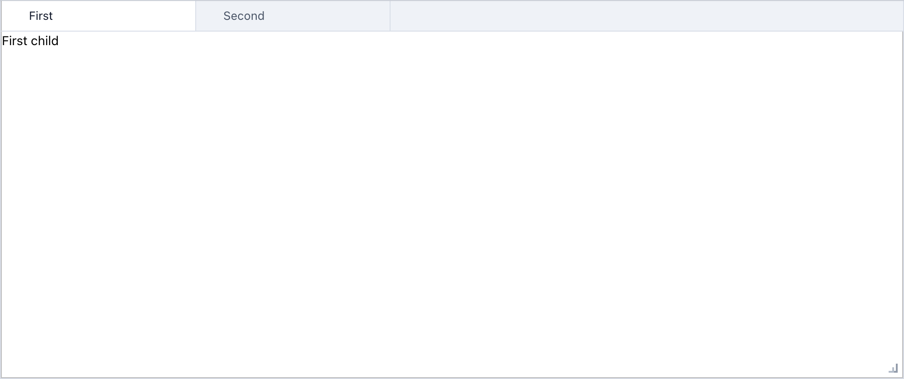
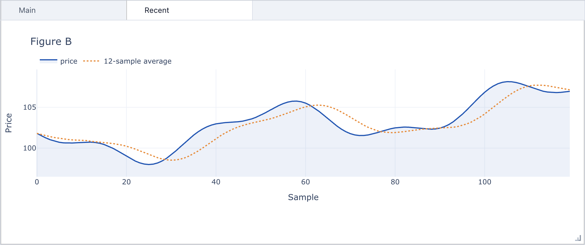
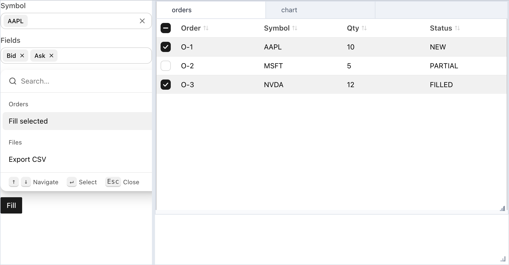
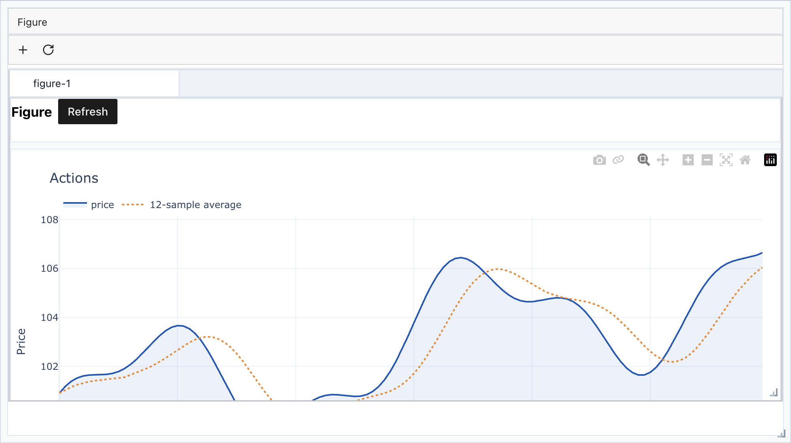

## Minimal tabs

```python
from anylumino import TabPanel
from anylumino import astryx as ax

TabPanel(
    {
        "first": ax.Text("First child"),
        "second": ax.Text("Second child"),
    },
    titles={"first": "First", "second": "Second"},
)
```



## Add a tab after display

```python
tabs = TabPanel({"main": figure_a}, titles={"main": "Main"})
tabs

tabs.add("recent", figure_b, title="Recent", select=True)
```



## Order blotter with callbacks

The Fill button marks the checked rows as filled and reports the count, so the
table, the status line, and the filters stay in sync from one callback:

```python
import anylumino as al
import anylumino.astryx as ax

status = ax.Text("Select orders, then press Fill")

orders = ax.Table(
    rows=order_rows,
    columns={"order_id": "Order", "symbol": "Symbol", "qty": "Qty", "status": "Status"},
    row_key="order_id",
    selected=["O-1", "O-3"],
    selects="multiple",
    sortable=True,
)

def fill_selected(_button):
    for order_id in orders.selected:
        orders.update_row(order_id, {"status": "FILLED"})
    status.text = f"Filled {len(orders.selected)} orders"

filters = ax.Theme(
    {
        "symbol": ax.Typeahead(
            ["AAPL", "MSFT", "NVDA"],
            value="AAPL",
            label="Symbol",
        ),
        "fields": ax.Tokenizer(
            ["Bid", "Ask", "Last"],
            value=["Bid", "Ask"],
            label="Fields",
        ),
        "commands": ax.CommandPalette(
            [
                {"id": "fill", "label": "Fill selected", "auxiliaryData": {"group": "Orders"}},
                {"id": "export", "label": "Export CSV", "auxiliaryData": {"group": "Files"}},
            ],
            value="fill",
            width=320,
        ),
        "fill": ax.Button("Fill", variant="primary", callbacks=[fill_selected]),
    },
    gap=3,
)

tabs = al.TabPanel({"orders": orders, "chart": trend_figure})
al.SplitPanel(
    {"filters": filters, "workspace": al.VBox({"tabs": tabs, "status": status}, stretches=[1, 0])},
    sizes=[0.3, 0.7],
    height=520,
)
```



## Lumino action skeleton

```python
import anylumino as al

actions = [
    {"id": "new-figure", "label": "New figure", "icon": "AddContent"},
    {"id": "refresh", "label": "Refresh", "icon": "RotateRight"},
]

callbacks = {
    "new-figure": lambda _id: tabs.add(
        "figure-2",
        new_figure,
        title="Figure 2",
        select=True,
    ),
    "refresh": lambda _id: tabs.call_owner(tabs.selected_key, "refresh"),
}

toolbar = al.Toolbar(actions, callbacks=callbacks)
menu = al.MenuBar([{"label": "Figure", "items": actions}], callbacks=callbacks)

tabs = al.TabPanel({"figure-1": figure_panel})
al.GridPanel(
    {"menu": menu, "toolbar": toolbar, "workspace": tabs},
    columns="1fr",
    rows="34px 44px minmax(0, 1fr)",
    gap=0,
    height=560,
)
```



Lumino action widgets still use bundled workflow icon names such as
`AddContent` and `RotateRight`. Astryx widgets use their own component props and
brand tokens.

The frontend bundles are shipped with anylumino, so these examples do not
require CDN access for Lumino, Astryx, or bundled workflow icons.

## Local notebooks

The repository includes Jupytext notebooks for smoke testing:

- `notebooks/docs_examples.py` collects every example on these documentation
  pages in page order; `scripts/docs_examples.py` regenerates it and the
  screenshots come from `scripts/capture-docs-screenshots.mjs`.
- `notebooks/plotly_tabs.py` tests tabs and dynamic child addition with Plotly
  figures.
- `notebooks/plotly_dashboard.py` exercises all layout and action widgets with
  Plotly figure updates.
- `notebooks/astryx_components_smoke.py` covers the Astryx component family,
  theme propagation, static search wrappers, and inline dialog wrappers.
- `notebooks/astryx_layout_panels.py` shows the Astryx layout panels, tabs,
  stacked, accordion, scroll box, split, and responsive, with Python-driven
  selection, open sections, and split sizes, and nests them together.
- `notebooks/astryx_table.py` focuses on Astryx table selection, sorting, and
  row helper behavior.
- `notebooks/itables_tabs.py` places an `itables.widget.ITable` inside a tab,
  appends rows to a pandas DataFrame, and refreshes the displayed table with
  `ITable.update(...)`.
