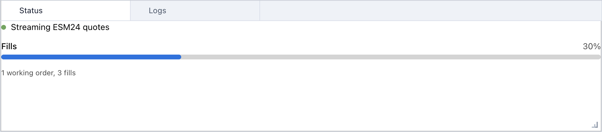
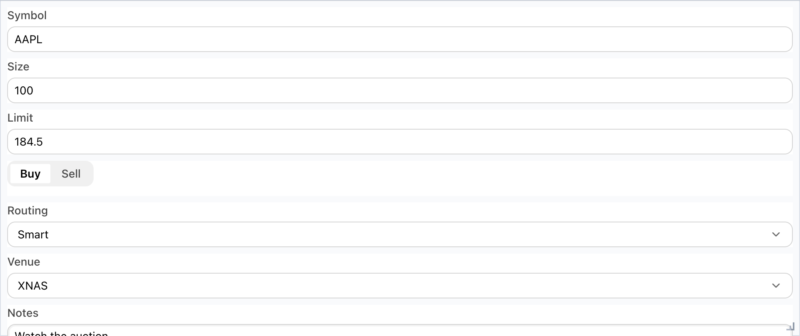
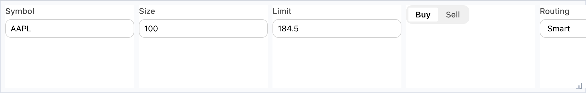
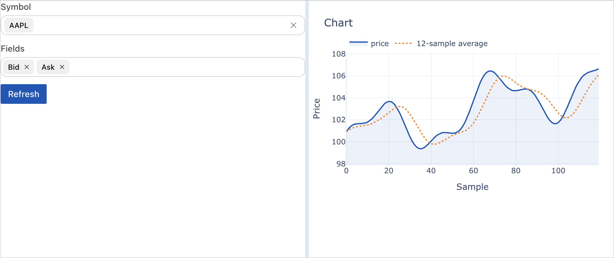
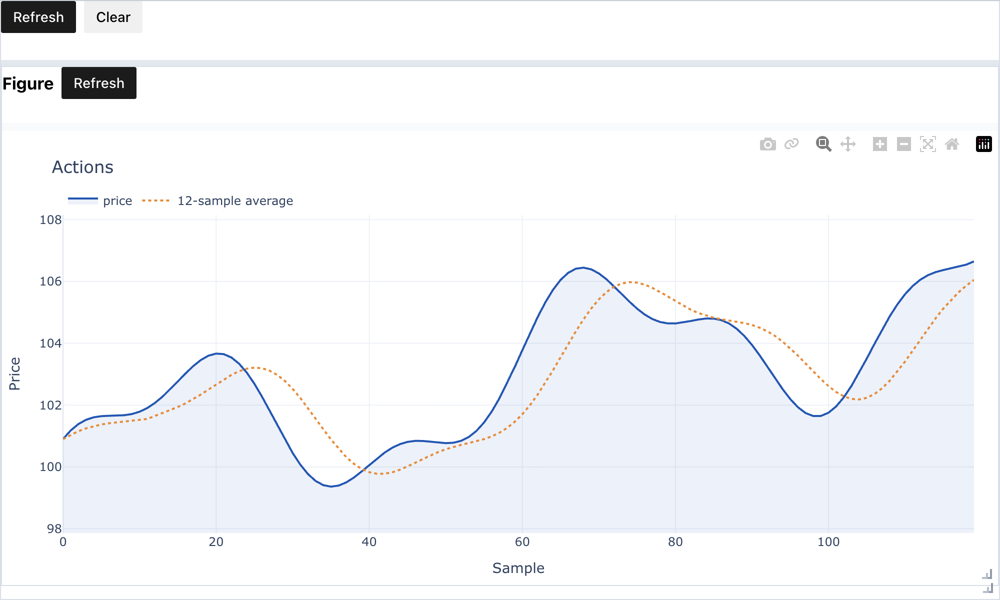

## LayoutWidget

`LayoutWidget` is the public base class for anylumino layouts. `TabPanel`,
`SplitPanel`, `VBox`, `GridPanel`, and the other layout widgets all share its
composition API: keyed children, child lookup, dynamic mutation, and method
forwarding.

The goal is to make bigger widgets from existing widgets. A composed widget can
combine anywidgets, Astryx components, charts, tables, and outputs into one
reusable object. Because that object is still an anywidget, it can be nested
again inside tabs, split panes, dock panels, or another domain-specific
component.

This makes notebook interfaces easier to structure: child widgets are
addressable by key, callbacks can mutate sibling widgets, and application state
can live on a composed object such as `FigurePanel`, `SampleReview`, or
`LabDashboard` instead of in notebook-global variables.

## Child widgets

Every `LayoutWidget` accepts children either as a sequence or as a mapping. A
mapping is preferred for application-style notebooks because it gives each child
a stable key:

```python
from anylumino import TabPanel
from anylumino import astryx as ax

tabs = TabPanel(
    {
        "status": ax.Stack(
            {
                "connection": ax.Stack(
                    {
                        "dot": ax.StatusDot("Connected", variant="success", pulsing=True),
                        "text": ax.Text("Streaming ESM24 quotes"),
                    },
                    direction="horizontal",
                    align="center",
                    gap=2,
                ),
                "fills": ax.ProgressBar(3, label="Fills", max=10, value_label=True),
                "summary": ax.Text("1 working order, 3 fills", text_type="supporting", color="secondary"),
            },
            gap=3,
        ),
        "logs": ax.List(
            [
                {"label": "Session started", "description": "13:30:00"},
                {"label": "Subscribed ESM24", "description": "13:30:02"},
                {"label": "First fill", "description": "13:31:14"},
            ],
            dividers=True,
            density="compact",
        ),
    },
    titles={"status": "Status", "logs": "Logs"},
    height=220,
)
```



If `titles` is omitted for a mapping, the child keys are used as the titles.

## Accessing children

Layout widgets keep both a renderable widget and an owner object. This is useful
when a domain wrapper exposes a `.widget` view but also has methods that should
be called from Python.

```python
tabs = TabPanel({"trend": trend_panel})

tabs.get_widget("trend")      # rendered child, usually trend_panel.widget
tabs.get_owner("trend")       # original wrapper object
tabs["trend"]                 # same as get_owner("trend")
tabs.call_owner("trend", "refresh")
```

## Adding methods to composed widgets

Add methods directly to an anylumino layout by subclassing one of the public
layout widgets. The subclass is still an anywidget, so it can be nested inside
another layout.

```python
import anylumino as al
import anylumino.astryx as ax

class FigurePanel(al.VBox):
    def __init__(self, figure):
        self.figure = figure
        toolbar = ax.Stack(
            {
                "title": ax.Heading("Figure", level=3),
                "refresh": ax.Button(
                    "Refresh",
                    variant="primary",
                    callbacks=[lambda _button: self.refresh()],
                ),
            },
            direction="horizontal",
            align="center",
            gap=2,
        )
        super().__init__(
            {"toolbar": toolbar, "figure": figure},
            stretches=[0, 1],
            child_min_height=56,
            height=520,
        )

    def refresh(self):
        update_figure(self.figure)

    def set_data(self, data):
        self.figure.data = data

tabs = al.TabPanel({"trend": FigurePanel(figure)})
tabs["trend"].refresh()
```

When a wrapper only adds Python behavior around an existing widget, it does not
need to subclass `anywidget.AnyWidget`. Expose the renderable child as `.widget`;
anylumino renders that view and keeps the wrapper as the keyed owner.

```python
class FigureWrapper:
    def __init__(self, figure):
        self.figure = figure
        self.widget = figure

    def refresh(self):
        update_figure(self.figure)

tabs = TabPanel({"trend": FigureWrapper(figure)})

tabs.get_widget("trend")  # figure
tabs["trend"].refresh()   # wrapper.refresh()
tabs.call_owner("trend", "refresh")
```

Use a `LayoutWidget` subclass when the wrapper is itself UI or layout. Use a
plain `.widget` owner wrapper when the wrapper only coordinates Python methods.

## Mutating layouts after display

Children can be added, renamed, removed, and selected after the parent widget is
already displayed:

```python
tabs.add("figure-2", figure, title="Figure 2", select=True)
tabs.rename_widget("figure-2", "Recent sample")
tabs.select_key("figure-2")
removed = tabs.remove_widget("figure-2")
```

## Scroll behavior

`HBox`, `VBox`, and `ScrollBox` can expose scrollbars inside notebook output.
The `scroll=True` convenience follows the natural axis:

```python
from anylumino import HBox, ScrollBox

wide = HBox(children, scroll=True, child_min_width=180, spacing=12, height=160)
vertical = ScrollBox(children, height=420)
```



For explicit overflow control:

```python
HBox(
    children,
    scroll_x=True,
    scroll_y=False,
    spacing=12,
    child_min_width=220,
    height=160,
)
```



`spacing` controls the gap between children. `child_min_width` and
`child_min_height` reserve enough room for each child, and `scroll=True` lets a
row scroll instead of compressing controls until labels or inputs clip.

## Resizing

Composed layouts are resizable by drag and drop by default. The resize handle is
shown in the bottom-right corner of the layout host.

```python
from anylumino import SplitPanel

SplitPanel({"left": controls, "right": chart}, sizes=[0.3, 0.7])
SplitPanel({"left": controls, "right": chart}, resizable=False)
```



`SplitPanel` uses Lumino split handles between child panes. The layout host
resize handle controls the overall notebook footprint. When panes are adjusted
with Lumino split handles, the current relative pane sizes are synced back to
the `sizes` trait so Python can inspect or reuse them.

## Actions and callbacks

Actions are plain dictionaries keyed by an `id`. The matching callback receives
the action id.

```python
import anylumino as al
import anylumino.astryx as ax

toolbar = ax.Stack(
    {
        "refresh": ax.Button(
            "Refresh",
            variant="primary",
            callbacks=[lambda _button: figure_panel.refresh()],
        ),
        "clear": ax.Button(
            "Clear",
            callbacks=[lambda _button: figure_panel.set_data([])],
        ),
    },
    direction="horizontal",
    gap=2,
)

al.SplitPanel(
    {"toolbar": toolbar, "panel": figure_panel},
    orientation="vertical",
    sizes=[0.1, 0.9],
    height=600,
)
```



For compact application chrome, the Lumino-style `Toolbar`, `MenuBar`, and
`CommandPalette` remain available and dispatch action ids to Python callbacks.
For notebook content, prefer Astryx controls such as `Button`,
`CommandPalette`, and `SegmentedControl` because they share the
same visual system as forms, tables, and status surfaces.

Lumino, Astryx, and the bundled workflow icon set are compiled into
anylumino's frontend bundles, so notebooks do not need CDN access at runtime.
